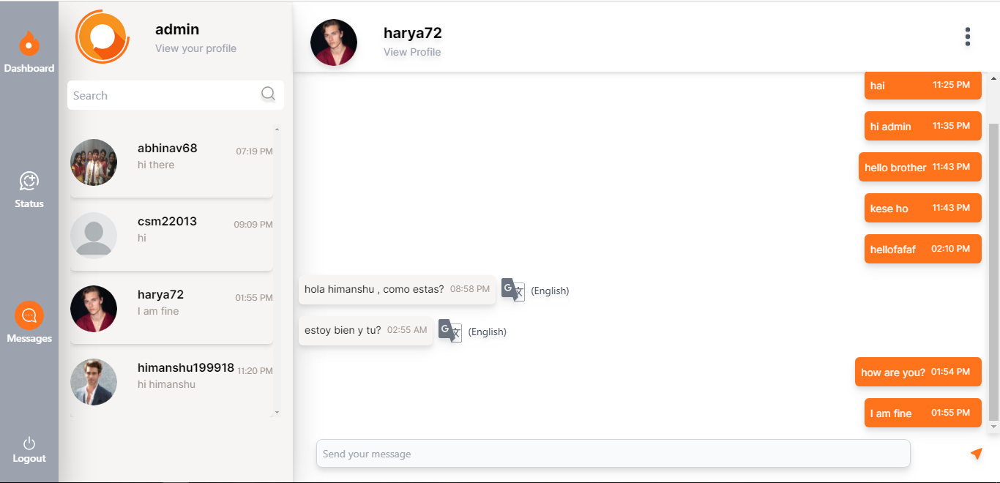

# Real-Time Chat Application

A real-time chat application built using React for the front-end and Django with Django Channels for the back-end. The application supports real-time messaging, JWT authentication, OAuth, and message translation using the LibreTranslate API.

## Features

- **Real-Time Messaging**: Send and receive messages instantly.
- **JWT Authentication**: Secure authentication using JSON Web Tokens.
- **OAuth Integration**: Login with third-party providers.
- **Message Translation**: Translate messages in real-time using the LibreTranslate API.
- **Typing Indicator**: See when someone is typing a message.
- **Online Status**: Check who is online.
- **Status Upload**: Upload and share status updates.
- **Pagination**: Efficiently load older messages.

## Technologies Used

- **Front-End**: React, WebSockets
- **Back-End**: Django, Django Channels, Django REST Framework
- **Authentication**: JWT, OAuth
- **Translation**: LibreTranslate API
- **Database**: SQLite

## Installation

### Prerequisites

- Node.js
- Python 3.8+

### Clone the Repository

```bash
git clone https://github.com/harya72/Chatwave.git
cd Chatwave
```

### Back-End Setup

1. **Create a virtual environment and activate it:**

    ```bash
    python -m venv env
    source env/bin/activate  # On Windows use `env\Scripts\activate`
    ```

2. **Create a `.env` file inside the `backend` folder with the following environment variables:**

    ```env
    # Django settings
    SECRET_KEY = your_secret_key

    # SMTP CREDENTIALS
    EMAIL_HOST_USER = your_email_host_user
    EMAIL_HOST_PASSWORD = your_email_host_password

    # GOOGLE CREDENTIALS
    SOCIAL_AUTH_GOOGLE_OAUTH2_SECRET = your_google_oauth2_secret
    SOCIAL_AUTH_GOOGLE_OAUTH2_KEY = your_google_oauth2_key
    ```

3. **Install the required packages:**

    ```bash
    pip install -r requirements.txt
    ```

4. **Install the required packages for Translation API:**

    ```bash
    cd LibreTranslate
    pip install -r requirements.txt
    cd ..
    ```

5. **Apply migrations:**

    ```bash
    python manage.py migrate
    ```

6. **Run the Django development server:**

    ```bash
    python manage.py runserver
    ```

### Front-End Setup

1. **Navigate to the `frontend` directory:**

    ```bash
    cd frontend
    ```

2. **Create a `.env` file inside the `frontend` folder with the following environment variables:**

    ```env
    # GOOGLE CLIENT ID
    VITE_CLIENT_ID = your_google_client_id

    # DJANGO CLIENT ID & SECRET KEY FROM GOOGLE OAUTH APPLICATION
    VITE_DJANGO_CLIENT_ID = your_django_client_id
    VITE_DJANGO_CLIENT_SECRET_KEY = your_django_client_secret_key
    ```

3. **Install the required packages:**

    ```bash
    npm install
    ```

4. **Start the React development server:**

    ```bash
    npm run dev
    ```
## Screenshots

---

---

---

---

---


## License

This project is licensed under the MIT License - see the [LICENSE](LICENSE) file for details.

## Contributing

Pull requests are welcome. For major changes, please open an issue first to discuss what you would like to change.

## Acknowledgements

- [Django](https://www.djangoproject.com/)
- [React](https://reactjs.org/)
- [Django Channels](https://channels.readthedocs.io/en/stable/)
- [LibreTranslate](https://libretranslate.com/)

---
